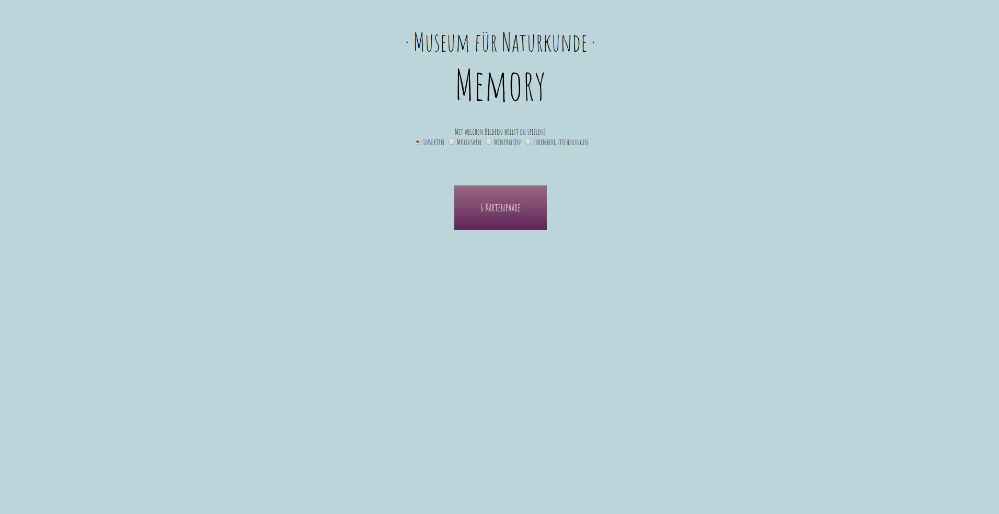
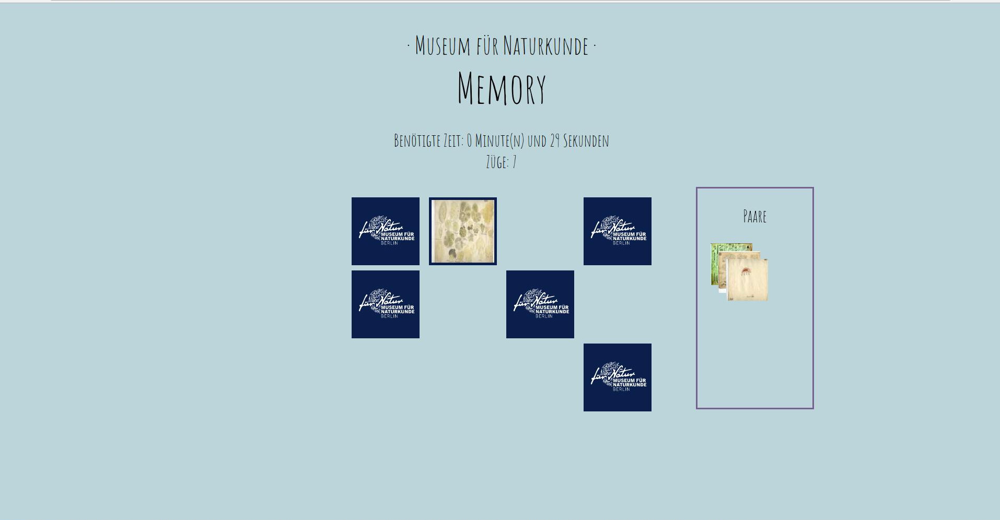
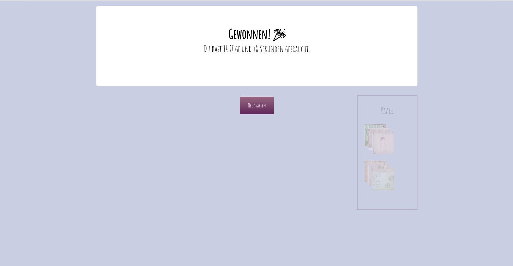
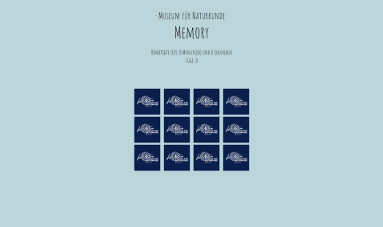
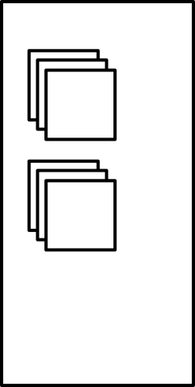
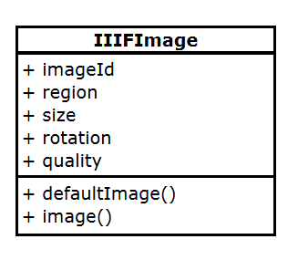

# Hacking the Museum


Ein Projekt der  


Die [Mediasphere For Nature](https://www.museumfuernaturkunde.berlin/de/forschung/forschungsbereiche/digitale-welt-und-informationswissenschaft/mediasphere-nature) ist aus dem EFRE-geförderten Projekt „Naturkunde 365/24 – Multimediales Applikationslabor des Berliner Naturkundemuseums“ hervorgegangen. Mit ihren Angeboten ebnet sie den Weg für Kooperationen von kleinen und mittelständischen Unternehmen (KMU) aus dem Berliner Raum mit dem Museum und erschafft damit eine Brücke zwischen Forschung und Wirtschaft. Neben dem Expertenwissen der ForscherInnen des Hauses sowie Vernetzungs- und Informationsangeboten erhalten die KMU exklusiven Zugang zum bedeutenden Wissensbestand an digitalen Inhalten. Das Museum für Naturkunde Berlin wird damit zu einer Anlaufstelle für die Entwicklung von wissensbasierten Produkt- und Service-Innovationen für Natur und Gesellschaft.

Unterstützt durch:  


<div class="page"/>

## Einführung

Im Rahmen des Projekts **„Naturkunde 365/24“** des **Museums für Naturkunde Berlin** entsteht die Broschüren-Reihe „Hacking the Museum“, in welcher Grundlagen unterschiedlicher Programmiersprachen vermittelt werden. Unter anderem wird gezeigt, wie Anfragen an die API des **Rechercheportals** gestellt werden, um hauseigenen Medien des Museums abzufragen.


Anhand eines **Memory-Spiels** wird ein Einblick in die Verwendung von **JavaScript** gegeben.

Unten sind ein paar Screenshots des fertigen Spiels zu sehen:

Der Startbildschirm    
</br>   

Das Spielfeld  
</br>      

Spielende  
</br>   


## Vorkenntnisse und Vorbereitung

Grundlegende Kenntnisse von **HTML** und **CSS** sollten vorhanden sein, da diese ohne umfassende Beschreibung eingesetzt werden.

Kontrollstrukturen wie _if-else_ und _for_ sowie die Verwendung von _Variablen_ und _Funktionen_ sollten auch bekannt sein.

Begleitend zu dieser Broschüre gibt es ein **Repository** auf **GitHub**. Das Repository kann von  https://github.com/MfN-Berlin/JavaScript-Memory
heruntergeladen werden. Wer sich mit Git auskennt kann es natürlich auch klonen oder einen fork erstellen.

Zu jedem Kapitel gibt es einen Ordner, begonnen wird mit _step-one_. Das Ergebnis aus dem ersten Kapitel ist dann im Ordner _step-two_, der als Anfang für das zweite Kapitel dient, zu sehen. Aber im besten Fall, wird der nicht benötigt. 

<div class="page"/>


#### Links
* https://www.w3schools.com
* https://git-scm.com/book/de/v2

---

<div class="page"/>


## 1. Spiel starten
_Ordner: step-one_

*Ziel:*  
*Im ersten Schritt wird das HTML um einen **Button** erweitert.
Wird dieser angeklickt, werden die Karten ausgeteilt.*

Dem **HTML-Gerüst** wird dafür zunächst ein **button-Element** hinzugefügt. Über das _onClick_-Event wird die Startfunktion _startGame_ aufgerufen. Diese bekommt als Parameter die Anzahl an Kartenpaaren mitgegeben, um später auf einfache Art die Anzahl an Karten zu verändern.

```html
 <button class="buttonNrCards" id="buttonNrCards6" onClick= "startGame(6)"> 6 Kartenpaare</button>
```

Die Funktion wird in der Datei _game.js_ implementiert, die im selben Verzeichnis wie die Index Datei erstellt wird. Durch den **Script-Tag** wird sie zwischen den **head-Tags** in das HTML eingebunden:

```HTML
<script src="game.js"></script>
```


So soll der Fensterinhalt nach dem Klick auf den Button aussehen:



Der Button ist weg, hinzugekommen ist eine Anzeige für die Zeit und die Züge sowie die _verdeckten_ Karten.

<div class="page"/>

In der aufgerufenen Funktion _startGame_ werden die einzelnen Schritte mit Hilfe von weiteren Funktionen ausgeführt:

``` {.javascript}
var numberCards = 0;

function startGame(nrCards){
    numberCards = nrCards;
    setupGameGrid(nrCards);
    let gameCards = pickCards(nrCards);
    dealCards(gameCards);
    showHideElements();
  }
```

* **setupGameGrid** bestimmt die Größe des Grids anhand der Anzahl der Karten
* **pickCards** wählt die Karten
* **dealCards** erstellt für jede Karte die passenden HTML-Elmente
* **showHideElements** setzt den Button auf unsichtbar und die Anzeige für Zeit und Züge wird Sichtbar

### Vorbereitung des Spielfelds

Bevor diese im Einzelnen beschrieben werden, bedarf es noch einiger Änderungen in der HTML Datei.
Für die Zeitangabe, die Anzahl der Züge sowie für die Anordnung der Karten auf dem Spielfeld wird je ein _div_  benötigt.

```html
<div id="timerDisplay" class="p2" ></div>
<div id="movesDisplay" class="p2"></div>
  <div>
      <button class="buttonNrCards" id="buttonNrCards6" onClick= "startGame(6)"> 6 Kartenpaare</button>
  </div>
  <div id="game">
    <div id="grid"></div>
  </div>
```

Die Funktion **_setupGameGrid_** stellt die **Größe des Spielfelds** über die CSS-Klasse ein.
Im späteren Verlauf soll der Spieler wählen können mit wie viel Kartenpaaren er spielen möchte.
Da diese Funktionalität noch nicht unterstützt wird ist die Implementierung recht simpel:

``` {.javascript}
function setupGameGrid(nrCards){
    let grid = document.getElementById('grid');
    if(nrCards == 6){
    grid.setAttribute('class', 'grid6');
    }
  }
```

### Karten wählen
Nun sollen die Karten gewählt werden. Noch haben wir allerdings gar keine _Karten_.
Zunächst werden die Bilder aus dem _img_ Ordner genommen, um die Funktionalität zu testen. Im Anschluss wird gezeigt, wie die Bilder mittels der API des **Museums für Naturkunde Berlin** geladen werden können.

In einem Array werden Objekte gespeichert, die zu jeder _Karte_ den Pfad und einen eindeutigen Namen bereithalten.

``` {.javascript}
let images = [
    {'name': 'anglerfisch', 'img': '../img/anglerfisch.jpg',},
    {'name': 'baumriese', 'img': '../img/baumriese.jpg',},
    {'name': 'crewmithund', 'img': '../img/crewmithund.jpg',},
    {'name': 'drachenfisch', 'img': '../img/drachenfisch.jpg',},
    ...
  ];
```

Aus diesem Array wird eine zufällige Menge ausgewählt, die Anzahl entsprechicht der gewünschten Anzahl an Kartenpaaren.
Dazu muss das Array zunächst gemischt werden, um im Anschluss die ersten X Elemente für die Karten verwenden zu können.  
Die **Utility-Library Lodash** stellt die Funktion *_.sampleSize(collection, [n=1])* zur Verfügung, welche genau das in einem einzigen Funktionsaufruf erledigt. Als Parameter übergibt man eine **Collection**(das Array mit den Bildern) und die **gewünschte Anzahl an Elementen** (in unserem Fall die Anzahl der Kartenpaare). Zurückgegeben wird ein neues Array mit der gewünschten Länge mit zufälligen Elementen des vorigen Arrays, womit es sich wunderbar weiterarbeiten lässt.
Um diese Funktion nutzen zu können muss **lodash** über ein **Script Tag im _Header_** eingebunden werden. Auf der Internetseite von Lodash (https://lodash.com/) findet man unter dem stichwort _cdn_, einen Link. Dieser wird als Wert für das src-Attribut verwendet:

```html
<script src="https://cdn.jsdelivr.net/npm/lodash@4.17.5/lodash.min.js"></script>
```

Für ein Memory-Spiel wird jede Karte zweimal benötigt. Daher wird das Array mit den gewählten Kartenbildern mit  _Array.concat(collection)_ verdoppelt und noch mal gemischt.  
Das ganze sieht dann so aus:

```javascript
function pickCards(nrCards){
    let cardSelection=_.sampleSize(images, nrCards);
    return _.shuffle(cardSelection.concat(cardSelection));
   }
```

**_.sampleSize** und **_.shuffle** sind Methoden aus der **lodash-Bibliothek**. Man erkennt sie an dem vorgesetzten Unterstrich.


### Karten Austeilen

Das Austeilen der Karten geschieht in der Funktion _dealCards_. Mit _forEach_ wird über das Array _gameCards_ iteriert und für jedes Element wird ein _div_ erstellt. Der CSS-Eigenschaft _background-image_ wird der Pfad zum Bild übergeben. Mithilfe von _dataset_ können selbstdefinierte Attribute an ein HTML-Element gehängt werden. Hier wird der Name verwendet, um später überprüfen zu können, ob zwei Karten das gleiche Bild darstellen.  

Um es so aussehen zu lassen, als ob die Karten gedreht werden, werden die CSS Eigenschaften _backface-visibility_ und _transform_ verwendet. Dafür wird jeweils ein _div_ für die Vorder- und eines für die Rückseite verwendet. In den zugehörigen CSS-Klassen _front_ und _back_ ist der Einsatz der beiden genannten CSS Eigenschaften dargestellt. Unter https://jsfiddle.net/melanieKrauth/vdt9jcpk/ gibt es ein JSFiddle das die Eigenschaft _backface-visibility_ ebenfalls demonstriert.

```javascript

   function dealCards(gameCards){
    let grid = document.getElementById('grid');
    gameCards.forEach(function(item){
      var name = item.name;
      var img = item.img;
      var card = document.createElement('div');
      card.classList.add('card');
      card.dataset.name = name;

      let front = document.createElement('div');
      front.classList.add('front');
      
      let back = document.createElement('div');
      back.classList.add('back');
      back.style.backgroundImage = `url(${img})`; 

      grid.appendChild(card);
      card.appendChild(front);
      card.appendChild(back);

    });
}
```

Zugegeben, es ist hier ein bisschen verwirrend, dass das _div_ der Klasse _back_ das Bild als Hintergrund gesetzt wird - das ist historisch gewachsen ;-)

<div class="page"/>

> __dataset Attribute__
>
> Durch _card.dataset.name_ wird dem HTML-Element ein individuelles Attribut angehängt. Informationen die nicht dargestellt werden sollen, können so JavaScript und CSS zur Verfügung
> gestellt werden. In HTML müssen diese Attribute mit **data-** beginnen und dürfen nur aus Kleinbuchstaben bestehen. Die Anzahl der Attribute ist beliebig.
>```html
> <div class="card" data-name=name></div>
> ```
>
> Beim Zugriff durch JavaScript wird das _data-_ weggelassen
> ```javascript
> document.getElementById(id).dataset.name
> ```
> Weitere Information unter   
  https://www.w3schools.com/tags/att_global_data.asp
>


Zuletzt wird die Sichtbarkeit der nicht benötigten Elemente und die Anzeige für Zeit und Züge folgendermaßen gesetzt:

```javascript
function showHideElements() {
  document.getElementById('movesDisplay').innerHTML= "Züge: 0";
  document.getElementById('timerDisplay').innerHTML= "Benötigte Zeit: 0 Minute(n) und 0 Sekunden";
  document.getElementById('buttonNrCards6').disabled = true;
  document.getElementById('buttonNrCards6').style.display = 'none';
}
```

#### Links
* https://lodash.com/
* https://lodash.com/docs/4.17.10#sampleSize
* https://lodash.com/docs/4.17.10#shuffle
* https://www.w3schools.com/CSSref/css3_pr_backface-visibility.asp

---

<div class="page"/>


## 2. Spielen
_Ordner: step-two_

*Ziel:*  
*Die Karten drehen sich um wenn sie angeklickt werden.
Es können maximal 2 Karten angeklickt werden und nach einer gewissen Zeit werden diese wieder automatisch umgedreht.
Sind die ausgewählten Karten gleich, bleiben sie aufgedeckt liegen.
Die benötigte Zeit und Anzahl an Zügen wird angezeigt.*


Wird jetzt mit der Maus auf eine Karte geklickt, passiert - nichts!  
Also fügen wir dem _grid_ am Ende der _dealCards_ Funktion einen **EventListener** hinzu. Wenn eine Karte mit der Maus angeklickt wird, soll zunächst etwas auf der Konsole ausgegeben werden:

 ```javascript
  grid.addEventListener('click', () => console.log('click'));
 ```
Die Funktion _addEventListener_ erwartet zwei Parameter, einen String, der den Typ des Events angibt und eine Funktion, die aufgerufen wird, wenn dieses Event eintrifft. Dieser Funktion wird bei Aufruf ein _Event-Objekt_ übergeben.

_() => console.log('click')_ ist eine **Pfeilfunktion** und äquivalent zu _function printClick() {console.log('click')}_

 >
 > **EventListener**  
 > Aus HTML ist eventuell das _onClick_ Event Attribut bekannt. Mit diesem lässt sich festlegen, was passieren soll, wenn das Element 
 > angeklickt wird. Das Anklicken wird als _Event_ bezeichnet, es gibt eine Reihe an Events unterschiedlicher Kategorien. Mit der
 > _addEventListener_ Funktion lassen sich mit JavaScript EventListener nachträglich an selektierte oder neu erstellte Elemente anfügen.   
 >
 > Syntax:  
 > _addEventListener(type, listener);_   
 >
 >* _type_ ist ein String der die Art des Events angibt  
 > * _listener_ ist die Funktion die aufgerufen werden soll, wenn dieses Event eintrifft. Als Parameter 
 wird bei Aufruf ein _Event_-Objekt übergeben. 
 > 
 > Dadurch ermöglicht JavaScript auf bestimmte Aktionen des Nutzers reagieren zu können und das HTML dynamisch zu verändern.
 > 
 > **Bubbling**  
 > Als _Bubbling_ bezeichnet man die Tatsache, dass, wenn eine Aktion auf einem Element ausgeführt wird, zunächst der ihm zugeordnete Listener aufgerufen wird, anschließend der des darüberliegenden Elements und so weiter bis hinauf zum _body_-Element. Das Element auf dem das Event tatsächlich ausgeführt wurde, kann über _event.target_ abgefragt werden. 

<div class="page"/>

### Karten umdrehen

Um eine Karte _umzudrehen_, wird dieser eine neue CSS-Klasse zugewiesen:

```javascript
 function handleClick(event){
    event.target.parentNode.classList.add('selected');
  }
```
Die Animation ist im CSS dem übergeordneten _div_ zugeordnet, daher muss über _parentNode_ dessen Klassenliste um _selected_ erweitert werden.

Damit die _game.js_ nicht zu unübersichtlich wird, implementieren wir die Funktion _handleClick_ in einer neuen Datei mit dem Namen _handler.js_.

Anstelle der Pfeilfunktion wird nun die Funktion _handleClick_ vom _eventListener_ aufgerufen.

Um sicherszustellen, dass nur zwei Karten angeklickt werden, wird eine neue globale Variable _selectedCards_ erstellt und mit _0_ initialisiert. Die _handleClick_ wird um eine if-Abfrage erweitert, sodass die CSS-Klasse nur gesetzt wird, wenn die Anzahl der ausgewählten Karten kleiner zwei ist:

```javascript
 function handleClick(event){
    if(selectedCards < 2){
        event.target.parentNode.classList.add('selected');
        selectedCards++;
    }
  }
```

Hat man zwei Karten gewählt, sollen sich die Karten nach einer gewissen Zeit wieder umdrehen. Zeitliche Steuerungen werden mit Timeouts realisiert, die über die globale Funktion _setTimeout_ gesetzt werden.  
Die Signatur der Funktion sieht so aus:

_setTimeout(function, milliseconds);_

Ausprobieren kann man das auch in der JavaScript Konsole des Browsers, in Chrome und Firefox wird sie mit F12 geöffnet und dann der Tab Konsole gewählt.

Nach der angegebenen Zeit in Millisekunden wird die übergebene Funktion aufgerufen.

Um nach 1.5 Sekunden ein PopUp mit dem Inhalt _Hallo Welt_ im Browser zu öffnen, kann folgender Befehl in die JavaScript-Konsole eingegeben werden:

```javascript
  setTimeout(() => alert('Hallo Welt'), 1500);
```

Damit die Karten wieder umgedreht werden, muss das CSS nach einer gewissen Zeit wieder geändert werden. Zunächst werden alle Elemente mit der Klasse _selected_ gewählt, um dann von jedem dieser Elemente genau diese Klasse zu entfernen:

```javascript
  function resetGuesses(){
    selectedCards = 0;
    var selected = document.querySelectorAll('.selected');
    selected.forEach(card => card.classList.remove('selected'));
  }
```
In der _handleClick_ wird der Timeout ausgelöst, wenn zwei Karten selektiert sind.

```javascript
function handleClick(event){
  const selectedElement = event.target;
    if(selectedCards < 2){
        selectedElement.parentNode.classList.add('selected');
        selectedCards++;
    }
    else if(selectedCards ==2){
        setTimeout(resetGuesses, 1500);
    }
  }
```

Wenn jetzt zwischen die Karten geklickt wird, dreht sich das ganze Gitter. Um das zu verhindern findet zu Beginn der Funktion eine Überprüfung statt, dazu wird folgende Abfrage am Anfang der Funktion hinzugefügt:

```javascript
if(selectedElement.id === 'grid' ||
     selectedElement.parentNode.classList.contains('selected')){
       return;
    }
```

Bei der Gelegenheit wird auch gleich überprüft, ob das Element über die CSS-Klasse _selected_ verfügt, also schon ausgewählt ist. Lässt man diesen Test aus, kann die selbe Karte zweimal angeklickt werden und so den Timeout auslösen.

### Paare finden

Um die beiden gewählten Karten vergleichen zu können, werden die Elemente in ein Array gespeichert. Dazu wandeln wir die Variable _selectedCards_ in ein leeres Array um. In der _handleClick_ Funktion wird das Element diesem Array hinzugefügt. Somit können bei zwei Karten die Namen aus dem Dataset verglichen werden.
Sind sie gleich, wird die Methode _match()_ nach einer Sekunde aufgerufen. _match()_ macht nichts weiter als den beiden selektierten Karten neue CSS-Klassen zuzuordnen und das Array zurück zu setzen.

<div class="page"/>


```javascript
  function match(){
    selectedCards = [];
    const selected = document.querySelectorAll('.selected');
    selected.forEach(function(card){
      card.classList.add('disabled');
      card.classList.add('match');
      card.classList.remove('selected');
    });
  };
```

Und so sieht die erweiterte _handleClick_-Funktion aus:

```javascript
var selectedCards = [];

function handleClick(event){
    const selectedElement = event.target;

    if(selectedElement.id === 'grid' ||
     selectedElement.parentNode.classList.contains('selected')){
       return;
    }

    if(selectedCards.length < 2){
        selectedCards.push(event.target);
        selectedElement.parentNode.classList.add('selected');
    }
    else if(selectedCards.length ==2){
        if(selectedCards[0].parentNode.dataset.name === selectedCards[1].parentNode.dataset.name){
            setTimeout(match, 1000);
            return;
        }
        setTimeout(resetGuesses, 1500);
    }
  }
```

### Züge und Zeit zählen  
Um die Züge zu zählen, wird eine globale Variable _moves_ erstellt und eine Funktion implementiert, die diese hochzählt und ausgibt. Innerhalb der _match_ und _resetGuesses_ Funktion wird _incrementCounter_ aufgerufen.

<div class="page"/>

```javascript
function incrementCounter(){
    moves++;    
    document.getElementById('movesDisplay').innerHTML= "Züge: " + moves;
  }
```

Die Zeit anzuzeigen ist ein wenig komplexer. Dazu wird die Funktion _setInterval_ verwendet. Diese führt eine Funktion in bestimmten Abständen aus.
Wie _setTimeout_ übergibt man eine Funktion und die Intervalldauer in Millisekunden. Der Rückgabewert stellt eine ID dar, welche an _clearInterval_ übergeben werden kann, um die Wiederholung so anzuhalten.

In unserem Fall soll die Funktion jede Sekunde ausgeführt werden und dann die Zeit seit dem ersten Klick auf das Spielfeld zählen. Zunächst deklarieren wir zwei weitere globale Variablen namens _startTime_ und _intervalId_ die je auf _undefined_ gesetzt werden. An den Beginn der _handleClick_-Funktion kommt eine _if_-Abfrage. Ist _startTime_ _undefined_, so soll sie initial auf die aktuelle Zeit gesetzt werden. Diese holt man über ein neues _Date_-Objekt und der Funktion _getTime()_, welche die Anzahl an Millisekunden seit dem 1.1.1970 zurückgibt.

```javascript
function handleClick(event){
    if(startTime === undefined){
        startTime = new Date().getTime();
        intervalId = setInterval(calculateTime , 1000);
    }
    ...
}
```

In _calculateTime_ wird über ein weiteres _Date_-Objekt die aktuelle Zeit geholt und die Differenz zwischen zur Startzeit bestimmt. Um auch Minuten anzuzeigen, wird die vergangene Zeit durch 60 dividiert und mit _Math.floor()_ abgerundet. Die Sekunden werden mithilfe des Modulo-Operators bestimmt und beides anschließend in das entsprechende HTML-Element geschrieben.

```javascript
  function calculateTime(){
        var time = new Date().getTime() - startTime;
        elapsed = Math.floor((time / 100) / 10 );
        var min = 0, sec = 0;
        if(elapsed > 59){
          min = Math.floor(elapsed/60);
          sec = elapsed % 60;
        }else{
          sec = elapsed;
        }
        document.getElementById('timerDisplay').innerHTML= "Benötigte Zeit: "+ min +" Minute(n) und " + sec + " Sekunden";
  }
```

Sind alle Paare gefunden, soll _calculateTime_ nicht mehr aufgerufen werden. Eine weitere globale Variable _pairs_ speichert die Anzahl an gefundenen Paaren. Eine neue Funktion _incrementPairs_ überprüft, ob sie gleich der Anzahl an Paaren ist und ruft dann _clearInterval_ mit der ID auf. Die neu implementierte Funktion wird innerhalb der _if_-Abfrage aufgerufen, in der geprüft wird, ob die beiden selektierten Karten die gleichen sind.

```javascript
function incrementPairs(){
    pairs++;
    if(pairs === numberCards){
        clearInterval(intervalId)
    }
  }
```

#### Links
* https://developer.mozilla.org/en-US/docs/Web/JavaScript/Reference/Functions/Arrow_functions
* https://developer.mozilla.org/de/docs/Web/Events  
* https://developer.mozilla.org/de/docs/Web/API/Event  
* https://developer.mozilla.org/de/docs/Web/API/EventTarget/addEventListener
* https://www.w3schools.com/Jsref/met_win_settimeout.asp
* https://www.w3schools.com/jsref/met_win_setinterval.asp
* https://www.w3schools.com/js/js_dates.asp
* https://www.w3schools.com/js/js_date_methods.asp
* https://developer.mozilla.org/de/docs/Web/JavaScript/Reference/Global_Objects/Math/floor
---

<div class="page"/>

## 3. Karten vom Feld und Gewinnen
_Ordner: step-three_

*Ziel:*  
*Gefundene Paare verschwinden vom Spielfeld und werden an der rechten Seite angezeigt.
Sind alle Paare gefunden wird eine Zusammenfassung angezeigt und ein Ranking je nach benötigter Zeit und Anzahl von Zügen vergeben.*


### Bilder vom Spielfeld nehmen

Wurde ein Paar gefunden, soll es jetzt nicht mehr auf dem Spielfeld liegen bleiben, sondern am Rand gelistet werden. Es kommt ein weiteres _div_ mit der Id _side_ in die _index.html_. In der _showHideElements_-Funktion wird die _visibility_ auf _visible_ gesetzt.

 ```html
  <div id="game">
      <div id="grid"></div>
      <div id="side" >
          <p class="p2">Paare</p>
        </div>
    </div>
 ```

 ```javascript
  function showHideElements() {
    ...
    document.getElementById('side').style.visibility = 'visible';
  }
 ```

 Die Bilder der gefundenen Paare sollen in dem neu erstellten _div_ angezeigt und wie im folgendem Bild zu sehen übereinander gestapelt werden.



Beim ersten gefundenen Paar, soll das _div_ um ein weiteres _div_ (weiterführend auch in diesem Code-Abschnitt _Container_ genannt) erweitert werden. An diesen _Container_ werden die Bilder der nächsten drei gefundenen Paare angehängt. Das wird in der Funktion _handlePairs_ implementiert. Zunächt wird das _div_ mit der Id _side_ selektiert. Je nachdem wieviele Paare bereits gefunden wurden, wird ein neuer _Container_ erstellt, oder der letzte, bereits bestehende selektiert. Dann wird die Funktion _createFoundPairElement(name)_ aufgerufen und das zurückgegebene Element dem letzten bestehenden Bild angehängt. Dazu wird eine weitere Funktion _getLastChild(container)_ aufgerufen.

 ```javascript
 function handlePairs(clicked){
    let container = undefined;
    if(pairs === 1 || pairs % 3 == 1){
        container = document.createElement('div');
        container.className = 'container';
        document.getElementById("side").appendChild(container);
    }else{
        let list = document.getElementsByClassName('container');
        container = list[list.length-1];
    }
    let card = createFoundPairElement(clicked.parentNode.dataset.name);
    let parent = getLastChild(container);
    parent.appendChild(card);
  }
  ```

  _createFoundPairElement(name)_ erstellt ähnlich wie _dealCards_ ein neues _div_ mit dem Bild des gefundenen Paar.


  ```javascript
   function createFoundPairElement(name){
    let imgPath = '../img/'+name+'.jpg';
    let card = document.createElement('div');
    card.className = 'sideCard';
    const cardImage = document.createElement('div');
    cardImage.classList.add('sideCardImage');
    cardImage.style.backgroundImage = `url(${imgPath})`;
    card.appendChild(cardImage);
    return card;
  }
  ```

  _getLastChild(container)_ steigt durch die Kindknoten zum letzten hinab und gibt dieses zurück.

  ```javascript
  function getLastChild(container){
    while(container.hasChildNodes()){
        container = container.children[0]
    }
    return container;
  }
  ```

  Diese drei Funktionen kommen der übersicht halber wieder in eine extra Datei, _handler.js_.

  Aufgerufen wird _handlePairs_ nach der _match_ Funktion in _handleClick_. Die Bilder auf der Seite sollen auch nicht sofort erscheinen um einen schöneren Übergang zu erhalten. Daher wird wieder ein _setTimeout_ verwendet. Der Aufruf sieht diesmal anders aus:


 ```javascript
function handleClick(event){
...
    if(selectedCards.length === 2){
        if(selectedCards[0].parentNode.dataset.name === selectedCards[1].parentNode.dataset.name){
            setTimeout(match, 1000);
            incrementPairs();
            handlePairs(selectedElement);
...
  }
 ```

<div class="page"/>

### Spielende

Wenn alle paare gefunden sind, soll eine neue Anzeige mit der Zeit und einem Ranking erscheinen. Hier die zugehörigen weiteren HTML-Elemente:

```html
<div id="popup1" class="overlay">
        <div class="popup">
          <h1 class="p3">Gewonnen! </h1>
          <div class="result">
            <p class="p2">Du hast <span id=finalMove> </span> Züge und
              <span id=finalTime> </span> Sekunden gebraucht.
            </p>
            <p class="p3">
              <span id=starRating></span>
            </p>
          </div>
        </div>
        <div>
          <button class="restartButton" value="restart" onClick= "window.location.reload()">Neu starten</button>
        </div>
      </div>
```

Eine Funktion _endGame_ macht die Elemente sichtbar und fügt die Zeit und Züge ein. Abhängig von der Anzahl der Karten und der Züge gibt es 'Punkte'.

```javascript
function endGame(){
    let modal = document.getElementById("popup1")
    modal.classList.add("show");

    document.getElementById("finalMove").innerHTML = moves;
    document.getElementById("finalTime").innerHTML = elapsedTime;

      if(moves >= 6 && moves <10){
        document.getElementById('starRating').innerHTML= "Rating: &#9733 &#9733 &#9733";}
      else if(moves >= 10 && moves <14){
        document.getElementById('starRating').innerHTML= "Rating: &#9733 &#9733 &#9734";}
      else if(moves > 14){
        document.getElementById('starRating').innerHTML= "Rating: &#9733 &#9734 &#9734";}
}
```

Diese Funktion wird in _incrementPairs_ aufgerufen, wenn alle Paare gefunden wurden.

<div class="page"/>

## 4. Bilder von der API holen
_Ordner: step-four_

*Ziel:*  
*Die Bilder werden übers Netzwerk geholt.*

Um mehr Variation ins Spiel zu bringen werden die Bilder nicht mehr vom Ordner geladen, sondern über eine Schnittstelle vom **Museum für Naturkunde Berlin** geholt. Diese API bietet unterschiedliche Bildersets an. Um Inhalte von entfernten Quellen zu holen, bietet die _fetch_-API Möglichkeiten HTTP-Nachrichten zu verschicken. Zur Verfügungn steht die Funktion _fetch()_ und die Objekte _Headers_, _Request_ und _Response_.

Die Funktion hat einen vorgeschriebenen Parameter,  einen String der den Pfad zum gewünschten Inhalt enthält oder ein _Request_-Objekt. Optional kann ein _init_-Objekt mit weiteren Angaben für den Request übergeben werden. Der Rückgabewert ist ein _Promise_-Objekt, dazu gleich mehr.


Folgendes einfaches Beispiel von _fetch()_ lässt sich in der JavaScript Konsole des Browsers oder in einem JSFiddle testen:

 ``` javascript
fetch("https://ajax.googleapis.com/ajax/libs/jquery/2.1.3/jquery.min.js")
      .then(function (response) {
        if(!response.ok){
          throw Error(response.statusText);
        }
        return response.text();})
      .then(function (responseText) {
        console.log(responseText);})
      .catch(function(error){console.log('ERROR: ', error)});
 ```

Hier wird die JavaScript Library jQuery mittels _fetch_ geholt und in der Konsole angezeigt. Dies läuft asynchron, wenn eine Antwort empfangen wurde, werden die beiden aneinander geketteten _then_-Funktionen aufgerufen. Die zweite erhält das Ergebnis der _text_-Funktion die von der ersten zurückgegeben wird, als Parameter. Wenn der Status der Antwort nicht _ok_ ist wird eine Exception geworfen, sollten bei der Übertragung Netzwerkfehler auftreten, wird die _catch_-Funktion aufgerufen. Die Abfrage des Status muss manuell über das _ok_-Flag  erfolgen.

<div class="page"/>

>__Promises__  
 > Promises werden für asynchrone Berechnung/Operation eingesetzt. Sie können sich in einem der folgenden Zustände befinden:
> * _pending:_ Initialer Status, Berechnung/Operation ist noch nicht fertig gestellt.
> * _fulfilled:_ Berechnung/Operation erfolgreich abgeschlossen
> * _rejected:_  Berechnung/Operation gescheitert
>
> Promises haben eine _then_-Funktion. Dieser kann man als Parameter zwei Funktionen übergeben, eine die bei erfolgreiche Bereitstellung des Wertes ausgeführt wird, und die zweite für den Fehlerfall.
> Beide sind optional.
>
>Da _then_ auch wieder ein *Promise* zurückgibt, kann man mehrere hintereinander Ketten, siehe oben.

Das Museum für Naturkunde, Berlin arbeitet daran die digitalen Medien der Sammlung zur Verfügung zu stellen. Für die Bilder wird das IIIF Framework verwendet, welches von diversen Bibliotheken entwickelt wurde. Wikipedia beschreibt es folgendermaßen:

>
> Das International Interoperability Framework(IIIF) besteht aus zwei APIs.
>
>  *  Die _Image API_ definiert einen Web-Service zur Ausgabe von Bildern, zum Beispiel Format, Ausgabegröße und Zoomstufen, Ausschnitte, Farbtiefe und Rotation.
>  *  Die _Presentation API_ beschreibt die Ausgabe eines Objektes mit seinen bibliographischen und strukturellen Metadaten. Der Output erfolgt als JSON-LD-Objekte. Die Ausgabe der
> Images gemäß der _Image API_ ist integriert.
>

Um ein einzelnes Bild über die _Image API_ anzufordern muss folgende Syntax eingehalten werden:

```html
{scheme}://{server}{/prefix}/{identifier}/{region}/{size}/{rotation}/{quality}.{format}
```

Praktisch kann das so aussehen:

```html
http://www.example.org/image-service/abcd1234/full/full/0/default.jpg
```

Die Parameter _region_ und _size_ können neben _full_ unter anderem auch als Pixel oder Prozent im Format x,y,w,h angegeben werden. Dabei definieren x und y die linke obere Ecke des Ausschnitts und w und h die Breite und Höhe darstellen. Die _rotation_ erfolgt im Uhrzeigersinn in Grad. Wird ein Ausrufungszeichen davor gesetzt, wird das Bild zuerst gespiegelt und dann rotiert. Über den _quality_ Parameter können die Bilder beispielsweise in Graustufen angefordert werden. Ausführliche Informationen und Beispiele gibt es in der Dokumentation.

Die _Presentation API_ hält Informationen zu einem Objekt bereit, z.B einem Buch, in einer JSON Datei bereit, die Manifest genannt wird. Die einzelnen Ansichten des Objekts liegen in _Sequenzen_ und die einzelnen Bilder wiederum in einem _Canvas_ Container vor.

Unter https://jsfiddle.net/antkp8o0/61/ ist ein JSFiddle, in dem mittels _fetch_ ein Manifest geholt wird und die einzelnen Bilder angezeigt werden. Dieses Beispiel zeigt die Verwendung eines Manifests. Ausserdem können die verschiedenen request Parameter ausprobiert werden.


Unter https://download.mediasphere.museumfuernaturkunde.berlin/data/ finden sich Links zu Unterschiedlichen Bildersets vom Museum für Naturkunde, Berlin.


Im Memory Code wird eine neue Funktion hinzugefügt. Im finalen Ordner ist diese Funktion in einer Extra Datei, _getImagesFromAPI_ definiert.

```javascript
function getImages(manifestUrl) {
  fetch(manifestUrl)
    .then(function (data) {
      return data.json(); })
    .then(function (json) {
      images = [];
      json.sequences[0].canvases.forEach((c, index) =>
        images.push({
          'name': index.toString(),
          'img': c.images[0].resource.service['@id'] + '/full/227,153/0/default.jpg'
          })
      );
    });
}
```

Wie im JSFiddle wird über die einzelnen Canvases des Manifests iteriert. Diesmal allerdings, wird das Array mit einem Objekt bestehend aus der URL und dem Index gefüllt. Wird jetzt diese Funktion am Anfang der _game.js_ aufgerufen, werden anstelle der Bilder aus dem img-Ordner, Bilder von Museumsobjekten angezeigt. Natürlich muss die _manifestUrl_ mit übergeben werden.

Allerdings stimmt jetzt nicht mehr der _imgPath_ in der Funktion _createFoundPairElement_ zum anzeigen gefundener Paare auf der rechten Seite.

Dazu wird die Funktion _handleClick_  in der Datei _handler.js_ erweitert:

```javascript
...
  incrementPairs();
  let imgDiv = selectedElement.nextElementSibling
  let style = (imgDiv.currentStyle || window.getComputedStyle(imgDiv, false));
  let imgPath = style.backgroundImage.slice(4, -1).replace(/"/g, "");
  handlePairs(imgPath)
  return;
...
```

In _createFoundPairElement_ kann der Parameter dann direkt dem _cardImage.style.backgroundImage_ mit \`url(${imgPath})\` übergeben werden. Die Zeile `let imgPath = '../img/'+name+'.jpg';` kann gelöscht werden.

### Manifest Auswahl

Um zwischen den Bildersets wählen zu können, wird dem HTML ein _form_ Element mit vier _inputs_ vom Typ _radio_ hinzugefügt:

```html
<form id=select_image_set>
  Mit welchen Bildern willst du spielen?<br>
  <input type="radio" name="image_set" id="insects" onclick = "setManifest('insekten')" checked>Insekten
  <input type="radio" name="image_set" id="molluscs" onclick = "setManifest('mollusken')">Mollusken
  <input type="radio" name="image_set" id="minerals" onclick = "setManifest('mineralien')">Mineralien
  <input type="radio" name="image_set" id="ehrenberg" onclick = "setManifest('ehrenberg')">Ehrenberg zeichnungen
</form>
```
Wird einer dieser Radio Buttons angeklickt, wird die Funktion _setManifest_ aufgerufen, welche wiederum lediglich _getImages_ mit der gewählten URL aufruft.

```javascript
function setManifest(manifest){
  getImages(MANIFESTE[manifest]);
}
```

Die URLs zu den Manifesten werden in einem Objekt zu beginn der _game.js_ definiert:

```javascript
const MANIFESTE = {
  ehrenberg: "https://download.mediasphere.museumfuernaturkunde.berlin/data/ehrenberg_manifest.json",
  insekten: "https://download.mediasphere.museumfuernaturkunde.berlin/data/insekten_manifest.json",
  mollusken: "https://download.mediasphere.museumfuernaturkunde.berlin/data/mollusken_manifest.json",
  mineralien: "https://download.mediasphere.museumfuernaturkunde.berlin/data/mineralien_manifest.json"
}
```
 Die _getImages_ Funktion kann nun initial mit einem Wert aus dem _MANIFESTE_-Objekt aufgerufen werden.


## Zusatz: Klassen

Um all die Features der IIIF Image API zu nutzen schreiben wir eine Klasse, um auf einfache und sichere Art die Größe oder gewünschte Region zu setzen.



Die Klasse soll zwei Methoden haben, eine für die URL des _default_ Bildes, mit Region und Größe auf _full_, Rotation _0_. Eine weitere Methode, _image()_ gibt die URL mit den manuell geänderten Parametern zurück. Für die definierten Parameter _region_, _size_, _rotation_ und _quality_ gibt es Attribute mit je einer _set_ Methode.

Fangen wir einfach an:

```javascript
class IIIFImage{
  constructor( imageId){
    this._imageId = imageId;
    this._size = 'full';
    this._region = 'full';
    this._rotation = '0';
    this._quality = 'default.jpg';
  }
}
```


Klassen werden mit dem Schlüsselwort __*class*__ deklariert. Die Funktion _constructor_ wird beim erstellen einer Instanz mit dem _new_ Operator automatisch aufgerufen und ist dafür verantwortlich, den benötigten Speicher zur Verfügung zu stellen. Die Felder *_imageId*, *_size* etc werden ebenfalls im Konstruktor definiert. Sie sind in allen der Klasse zugehörigen Funktionen sichtbar.

<div class="page"/>

Alternativ können Klassen als sogenannte Expressions definiert werden:

```javascript
var IIIFImage = class{
   constructor( imageId){
    this._imageId = imageId;
    this._size = 'full';
    this._region = 'full';
    this._rotation = '0';
    this._quality = 'default.jpg';
  }
}
```

Eine Instanz dieser Klasse wird in beiden Fällen wie folgt erstellt:

```javascript
let iiif = new IIIFImage('ganz/lange/url/zur/ID/des/Bildes');

```

Das _hoisting_ funktioniert nicht für Klassen, soll heißen, sie muss vor Instantiierung deklariert sein.

Die *IIIFImage*-Klasse soll wie erwähnt zwei Funktionen haben um eine URL für das angegebene Bild zu generieren:

```javascript
defaultImage(){
      return this._imageId+'/full/full/0/default.jpg';
  }

  image(){
      return this._imageId+'/'+this._region+'/'+this._size+'/'+this._rotation+'/'+this._quality;
  }
```

Über den Punkt Operator können diese Funktionen nun aufgerufen werden:

```javascript
  let iiif = new IIIFImage('ganz/lange/url/zur/ID/des/Bildes');
  iiif.defaultImage();

```

Die Parameter können ebenfalls über den Punkt Operator aufgerufen und geändert werden. Da die IIIF ImageAPI aber Parameter in einem bestimmten Format erwartet, ist das in diesem Falle nicht erwünscht. Umgehen lässt sich das mit dem Schlüsselwort *set*, die eine Funktion an eine Objekteigenschaft bindet. Diese Funktion wird aufgerufen, wenn die Eigenschaft geändert wird.

<div class="page"/>


```javascript
class IIIFImage{
  ...
  set imageId(id){
    if(typeof id === "string")
      this._imageId = id;

  }
}
  let iiif = new IIIFImage('ganz/lange/url/zur/ID/des/Bildes');
  iiif._imageId = 'neue/URL/zu/einem/anderen/Bild';

```

Die __imageId_ wird jetzt nur neu gesetzt wenn sie vom Typ _"string"_ ist. Die ganze Klasse mit regulären Ausdrücken zur Überprüfung ist in einem JSFiddle unter https://jsfiddle.net/melanieKrauth/hbwm2yqn/ implementiert.

Ihr könnt nun euer Script um diese Klasse erweitern, dazu kommt sie am besten wieder in eine extra Datei, das ist zum einen übersichtlich und außerdem kann sie so leicht wiederverwendet werden.

#### Links
* https://developer.mozilla.org/en-US/docs/Web/API/Fetch_API
* https://developer.mozilla.org/en-US/docs/Web/API/Fetch_API/Using_Fetch
* https://iiif.io/technical-details/
* https://iiif.io/api/image/2.1/#image-request-parameters
